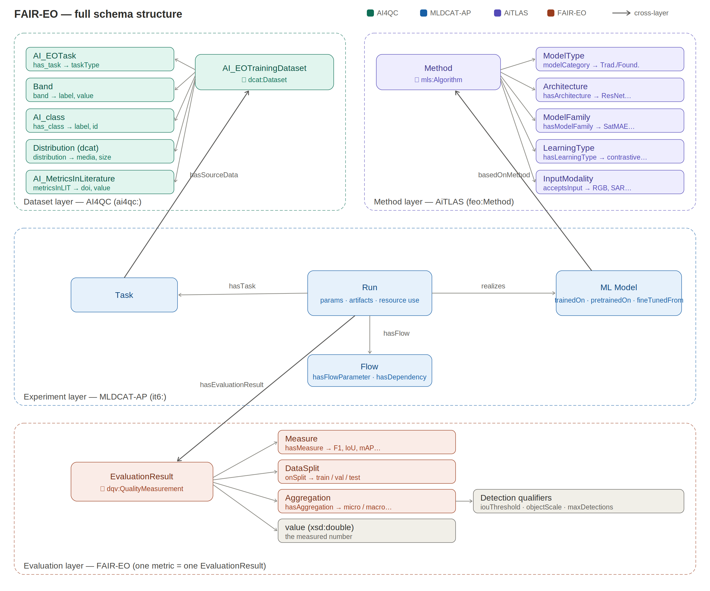

The schema used for semantic enrichment of the benchmarking framework can be seen below. (to possibly modify)

The 10 datasets used in this study were semantically annotated using the [AI4QC ontology](https://github.com/biasvariancelabs/AI4QC). Their metadata can be found in the [datasets.ttl]{ontology/metadata/datasets.ttl} file.
